# Modeling a bottom-line result

The [AF / AA example](../examples/example_bottom_line_af_aa.yaml) maps the
supplied provenance payload into the current development schema. It contains
11 Datasets, 9 Activities, and 1 File. All 24 supplied lineage edges are
preserved, with identifiers re-minted after the classes and fields change.
The additional final Dataset links to its File distribution and the publication
Activity. There is no need for a dedicated BottomLineResult or per-variant class.

This example is a reconstruction of the supplied payload, not independently
verified execution provenance. It targets the development schema, including
`Dataset.has_file` and `Dataset.location`; it does not claim compatibility with
the source payload's declared `0.1.0` release. Producers should pin the actual
schema commit or a release that includes these fields.

## The mapping

- A **Dataset** represents a logical data collection. Each source S3 prefix is
  a separate Dataset, including raw/processed/QC variants, rare/common
  partitions, staging, and the three ancestry-specific result collections.
  Its current prefix is `location`, not a filename or C2M2 registration.
- An **Activity** represents each of the nine reported pipeline stages.
  Source-code file URLs become `script_url`; the repository becomes `repo_url`.
  A link to `master` is not evidence of the code revision that executed.
- The final **File** represents `AF.sumstats.tsv.gz` at the supplied S3 object
  location. The logical published Dataset names it through `has_file`.
- **Used** links a stage to a consumed Dataset. **WasGeneratedBy** links each
  generated Dataset or File to its stage. The final Dataset uses the equivalent
  inline `was_generated_by` form.

```mermaid
flowchart LR
  raw[Raw variants Dataset] --> processing[VariantProcessingStage]
  processing --> processed[Processed Dataset]
  processed --> qc[VariantQCStage]
  qc --> qcdata[QC Dataset — inferred]
  qcdata --> scaling[VariantScalingStage]
  scaling --> variants[Variants Dataset]
  variants --> partition[PartitionStage]
  partition --> common[Common partition Dataset]
  partition --> rare[Rare partition Dataset]
  common --> metal[AncestrySpecificStage]
  metal --> staging[Staging Dataset — inferred]
  staging --> load[LoadAncestrySpecificStage]
  rare --> load
  common --> minp[MinPStage]
  rare --> minp
  common --> largest[LargestStage]
  rare --> largest
  load --> bottom[Bottom-line Dataset]
  minp --> minpdata[Min-p Dataset]
  largest --> largestdata[Largest Dataset]
  bottom --> publish[OpenDataTransferStage]
  minpdata --> publish
  largestdata --> publish
  publish --> file[AF.sumstats.tsv.gz File]
  publish --> result[Published result Dataset]
  result -- has_file --> file
```



Arrows above show data flow. The actual `prov:used` and
`prov:wasGeneratedBy` predicates point backward from stage to input and
resource to generating stage, respectively.

## What changes from the source payload

The mixed `provenance.dapper.nodes` and `edges` container is an application
wrapper, not the graph-document format accepted by the DAPPER linter. The
example uses `datasets`, `files`, `activities`, `used_edges`, and
`was_generated_by_edges`. Type information follows from each group; no
additional `class` or edge `id` fields are needed.

`resource_type: Dataset` is an invalid enum value; use `dataset`.
The wrapper's `dataset`, `rare`, `stage_group`, and
`annotation_source` fields are not declared attributes on these classes.
The relevant source context is retained in descriptions in this example.
Its `phenotype=AF` becomes `trait: KPN.TRAIT:0000096` on the eleven Datasets
and nine Activities, linking to the external trait catalog as described below.
The [ancestry vocabulary](ancestry.md) adds `ancestry: AA` to the seven Datasets
and five Activities explicitly scoped to that group. Other GWAS context can
be designed as a separate extension; adding arbitrary fields to a record does
not extend the schema.

The source's seven `C2M2File` entries describe prefix collections. No C2M2
registration was supplied, and none is a single physical file. Modeling these
as Dataset nodes also avoids inventing filenames such as `rare=true`.

The supplied final `drs://...` string has no server/object path pair or supplied
DRS response. It is replaced with an ordinary File and its S3 `location`.
Add a DrsObject only when actual registration metadata is available, then use
`drs_representation` for the File or `has_drs_object` for the Dataset.
[GA4GH defines DRS URIs and blob/bundle access](https://ga4gh.github.io/data-repository-service-schemas/preview/release/drs-1.0.0/docs/#_drs_uris).
The separation of a logical Dataset from a distribution also follows the
[DCAT distribution model](https://www.w3.org/TR/vocab-dcat-3/#Class:Distribution).

## Trait identity

`trait: KPN.TRAIT:0000096` identifies
[atrial fibrillation](https://broadinstitute.github.io/kpn-data-models/kpn.trait/0000096/).
The [KPN v0.0.1 registry](https://github.com/broadinstitute/kpn-data-models/blob/main/versions/phenotype/v0.0.1/portal_phenotype_registry.tsv)
maps the legacy source label `AF` to the stable numeric suffix `0000096`.
The KPN namespace replaces the registry's former `PORTAL` prefix while keeping
that suffix. `0000001` identifies age-related hearing impairment, not AF.

Dataset and Activity expose this optional, single-valued URI/CURIE field through
`TraitContext`. It is hashable because the measured trait is part of the record's
scientific scope. A bare `AF` string is not accepted as the trait identifier.
The existing AF filenames and source labels are retained for traceability.

The schema declares `KPN.TRAIT` as
`https://broadinstitute.github.io/kpn-data-models/kpn.trait/`. The portal displays
the CURIE as a clickable catalog link; the KPN site owns the trait definition
and ontology crosswalks. No trait node is copied into this provenance graph,
and File obtains its scientific context through the Dataset's `has_file` link.

## Evidence still missing

The source explicitly infers the QC output and ancestry-specific staging
output from code conventions. Their descriptions retain that distinction.
A listing-derived stage is not proof that a particular execution ran.
None of the supplied lineage assertions have been independently verified here.

The payload supplies no file checksums, immutable object versions, complete
partition manifests, runtime commands, run timestamps, or executed code commit.
It also lacks study attribution, citation, funding, and license metadata.
These should be supplied by the producer, not inferred from bucket names.
The existing controlled-access labels on the three intermediate results are
retained as source assertions; public access is not inferred from an
"open-data" name. The gzip filename is retained, but its media type is not
asserted from an unverified source value describing the uncompressed TSV.

DAPPER-ID-1 hashes the metadata record. A valid minted ID does not demonstrate
that the S3 bytes exist or identify an immutable snapshot. For partitioned
outputs, capture a real manifest of object versions and checksums before
claiming reproducible content identity.

## Validate

```bash
uv run schema/lint/lint_provenance.py schema/examples/example_bottom_line_af_aa.yaml
```

The complete example passes the bottom-line profile with no errors or warnings.
The profile accepts ordinary File distributions as well as DRS registrations;
schema validation cannot establish that the supplied provenance actually happened.
