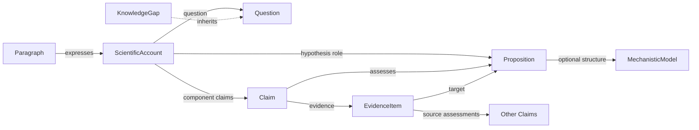

# Scientific Claims design

**Status:** Implemented experimental profile. The schema and examples support
the minimal workflow below. Definitions and interoperability mappings remain
open to revision through community use; this is not a completed claims standard.

## Purpose and scope

DAPPER should represent a small scientific account that a researcher can inspect,
trace to its sources, and communicate as a results paragraph. The immediate
horizon is a useful demonstration within two months. The aim is to preserve the
most important distinctions with a small representation that can evolve through
community use.

The organizing unit is a **ScientificAccount**: a structured account of what was
asked, how it was addressed, which claims were made, and what those claims may imply.
A **Paragraph** is a natural-language expression of that account, with its own
textual and publication metadata.

These are separate objects because scientific content can be expressed in
multiple ways and published in multiple places. The initial workflow can use
one ScientificAccount and one Paragraph without implementing a general document
model.

## The paragraph as a design constraint

A results paragraph provides four organizing roles:

1. **Framing:** the question, knowledge gap, or hypothesis motivating the work.
2. **Context:** the approach, relevant scope, models, and assumptions.
3. **Claims:** the attributed assertions or assessments produced through that work.
4. **Closing:** an optional conclusion, synthesis, limitation, or implication.

This is a rendering order, not a fixed sentence count. A role may occupy several
sentences, and a sentence may express several claims. Claims can concern
results or biology; their position does not determine their scientific meaning.

The structured account must contain enough information to express these roles
without inventing missing scientific content. Context can be summarized in the
paragraph while remaining accessible through linked records.

## Core definitions

### Proposition

A **Proposition** is content that can be evaluated as true or false within a
specified scope. It identifies what is being considered, independently of who
asserts it or how strongly it is supported.

The minimum representation is self-contained text and any scope essential to
its meaning. Structured entities, predicates, and qualifiers can be added where
useful. Different assessments can refer to the same Proposition. Shared wording
or similar wording alone does not establish semantic equivalence.

### Claim

A **Claim** is an attributed assertion or assessment of a Proposition. It records
what an agent puts forward, together with its evidential and production context.
A Claim can be uncertain, disputed, or later revised; the class name does not
imply established truth.

A Claim links to its Proposition, responsible agent, and generating or recording
activity. It can also link to evidence, source records, and assessments or scores.
Scientific production and later extraction or recording are distinct activities
when both are known.

Scores belong to a specified assessment and retain their metric, meaning, and
scope. Confidence in one claim does not automatically transfer to another claim
or to the whole ScientificAccount.

Use **Claim** as the DAPPER object name. “Assertion” describes putting content
forward and remains useful in ontology mappings and publication terminology;
it does not require a second parallel DAPPER class.

### Question

A **Question** expresses an inquiry that the work aims to address. It identifies
what is unknown and the relevant scope. It has no truth assessment or confidence
score. The minimum content is `text`, with optional `scope`, `about_entities`
(URI/CURIE references supplying entity context), and provenance.

`ScientificAccount.question` references a Question. Accounts can share it while
proposing different hypotheses. Claims can contribute to answering it, but the
existence of a linked Claim does not mean that the inquiry has been resolved.

### KnowledgeGap

A **KnowledgeGap** inherits from **Question**. It identifies a specific absence
of knowledge motivating an inquiry. Inherited `text` expresses the question;
required `gap_description` describes what is missing. It inherits scope and
provenance from Question and is accepted wherever a Question is referenced.
Optional `gap_kind` distinguishes `KNOWLEDGE_GAP` and `HUMAN_MODEL_MISMATCH`;
omission means unclassified. Neither value is a resolution status.

An account uses the same `question` field for a Question or a KnowledgeGap.
There is no parallel free-text gap field, and the gap is distinct from any
proposition proposed as its answer.

### Hypothesis (role)

A **Hypothesis** is a candidate answer or explanation proposed for investigation.
Its content is a Proposition, optionally elaborated by a MechanisticModel.
It may address the account's question.

Hypothesis describes the role of content in an investigation; Claim describes
an attributed assertion or assessment of content. They are not successive stages
on a confidence scale. Claims can assess the proposition used as a hypothesis,
and a proposed hypothesis can itself be put forward through a Claim.

`ScientificAccount.hypothesis` references the Proposition proposed for
investigation. A Claim can assess that exact same Proposition. The role belongs
to the account; it is not a global flag on Proposition and does not depend on
confidence. There is no standalone generic Hypothesis class.

### MechanisticModel (optional)

A **MechanisticModel** provides biological structure when a proposition needs
more than text and entity references. It carries a description, optional scope,
and optional CausalSteps connecting entities through Mechanisms. A Proposition
can reference it through `mechanistic_model`.

The model holds content. Scores, review status, and evidence of support belong
to Claims assessing that content. An account can also reference a model as shared
context without asserting it. A simple proposed explanation needs only a
Proposition; a mechanistic model is optional.

### ScientificAccount

A **ScientificAccount** is an attributed, structured scientific account that brings
Claims together around a shared inquiry and context. It records their
organization and, where supplied, the reasoning connecting them.

It is more than an unordered collection, but membership does not assert a
logical conjunction, causal chain, or support relation. Because framing can
include questions and the conclusion is optional, the whole account need not
have a single truth value or a single assessed Proposition.

`ScientificAccount` is an organizing object and does not inherit from Claim.
If the account makes an overall
scientific conclusion, represent that conclusion as an explicit Claim within
it. A ScientificAccount needs at least one claim; requiring two claims would add
an arbitrary restriction to the paragraph workflow.

### Paragraph

A **Paragraph** is a particular textual expression of a ScientificAccount. Its
minimum content is the text and a reference to the account it expresses.
Optional metadata identifies its author or generating activity, version,
language, publication, and location within that publication.

Optional `citations` anchor exact Claim, Question, or KnowledgeGap identifiers
and citation metadata revisions to spans in the saved text. Citation metadata
lives in a separate registry; citation is distinct from scientific support.
See the [citation contract](citations.md) for fields and validation rules.

A ScientificAccount can have several Paragraph expressions. Editing wording or
publication metadata need not change the underlying scientific account.
Changing scientific meaning requires updating the relevant structured content
and the link to its version. For the demo, a Paragraph expresses one
ScientificAccount; general document assembly is deferred.

## Results and biology are a separate axis

Distinguish the **scope of a Proposition** from its role in the paragraph and
from its assessment:

- **Result:** content about observations, measurements, or outputs of a specified
  analysis, including estimates and fitted model quantities.
- **Biological interpretation:** content about the biological system or process
  that the results are used to understand.
- **Unspecified:** content whose scope has not yet been classified.

This can begin as a small annotation on Proposition, rather than separate Claim
subclasses. Result claims can involve inference; they are not necessarily raw
observations. Biological interpretations can be strongly supported; they are
not necessarily speculative. Both may refer to the same biological entities,
so subject and object identifiers alone cannot determine the distinction.

Paragraph role, proposition scope, method of production, and confidence remain
independent. A hypothesis is not defined by being about biology, and a claim
is not defined by being about data. If one statement combines independently
assessed result and biological content, separate the propositions where practical.

## Context and the connection from results to biology

**Context** records what is needed to understand the work and its interpretation.
For the demo, use `context` text, an optional `assumptions` list, and an optional
`mechanistic_model` reference on the account. These cover:

- The inquiry's scope and relevant study or data setting.
- The analytical approach and statistical or computational model.
- The biological model being assumed or evaluated, when applicable.
- The assumptions and limitations relevant to interpreting the claims.

The analytical model and biological model need distinct descriptions even when
they are closely connected. The analytical model specifies how data become
estimates or outputs. The biological model describes the system those outputs
are intended to inform. A software version or execution command does not, by
itself, specify the biological interpretation.

An assumption is content being taken as given for an analysis or interpretation.
Recording it does not assert that the study established it. It can be text or a
reference to content in the context text; assessing it requires a Claim.

Context may be shared within a ScientificAccount. However, scope that changes a
Proposition's meaning must remain explicit on, or explicitly referenced by,
that Proposition. Moving a Claim between accounts must not silently change
what it says.

An **interpretation** records how claims bear on a target Proposition under
a stated context. It uses the existing **EvidenceItem** class, rather than a
new parallel Interpretation class:

- `source_claims` identifies the assessments being used as evidence.
- `target_proposition` identifies the content being evaluated.
- `direction` records SUPPORTS, DISPUTES, NEUTRAL, MIXED, or UNKNOWN.
- `explanation` supplies the rationale, and `context` states the applicable model
  or setting. `assumptions` and `mechanistic_model` add detail where applicable.
- Attribution and generation fields identify who made the interpretation and how.

A target Claim references this evidence use through `has_evidence`. Its
Proposition must match the evidence's target. Targeting the Proposition avoids
a reference cycle back to the Claim that owns the evidence. Evidence can also
retain a publication, snippet, or source nanopublication. When `source_claims`
is supplied, target, direction, explanation, and context are required.

Multiple evidence uses can assess the same proposition, including in opposing
directions. An EvidenceItem reused by several Claims retains the same target
and interpretation. The relation records an evidential argument, not guaranteed
logical entailment or an automatic probability update. Circular support between
Claims is rejected.

When an account uses results to justify a biological Claim, this connection must
be explicit. A biological proposition used only as hypothesis framing need not have
supporting claims. An interpretation may remain unassessed; missing reasoning
must remain visible rather than being inferred from paragraph order.

**Provenance and evidence answer different questions.** Provenance records how
an artifact or assertion was produced. An evidence interpretation records why information
bears on a proposition. Both are needed to trace a biological conclusion back
through result claims, outputs, activities, and inputs. Reuse DAPPER's existing
provenance graph for files, commands, software, and intermediate artifacts;
do not copy that graph into paragraph context.

## Minimum ScientificAccount structure and linkages

The record has six conceptual parts, represented by the following fields:

- **Framing — required:** `question` references a Question or KnowledgeGap,
  and/or `hypothesis` references a Proposition. Both may coexist.
- **Context — required:** `context` provides a concise account of the approach and the relevant
  scope, with model and assumption information where applicable.
- **Component claims — required:** `component_claims` is an ordered list containing at least one
  claim before the optional closing. Claims can be reused across accounts.
- **Evidence interpretations — optional:** `Claim.has_evidence` links claims
  through EvidenceItems. Use explicit evidence records wherever one Claim is
  presented as justification for another; membership alone supplies no argument.
- **Closing — optional:** `conclusion_claims` selects component Claims for the
  closing, and `closing_remarks` holds editorial context.
- **Attribution and provenance — required:** `was_attributed_to` and
  `was_generated_by` identify the assembler and assembly/recording activity.

Closing claim references select from the component claims rather than duplicating
their content. A substantive scientific assertion introduced in the closing
must be represented as a Claim. A restatement or editorial remark need not
create a new Claim. Framing and context can reference Claims for scientific
assertions being assessed; assumptions remain explicitly marked as assumed.

The account associates its question with a proposition proposed as its hypothesis. Claim-to-proposition
links identify assessed content. Account-to-claim links express membership.
EvidenceItems express evidential use. Paragraph-to-account links express
textual realization. These relations must not be treated as interchangeable.

## Translating the account into a results paragraph

Rendering follows framing, context, claims, and optional closing. Component
Claims selected for the closing are expressed there; the remaining claims
follow their declared order. Ordering alone conveys no evidential dependency.

The rendering must preserve scope, attribution where relevant, uncertainty,
assessment direction, and the stated distinction between results and biological
interpretation. Transitions that explain evidential support must come from
recorded EvidenceItems. Rendering must not introduce stronger causal language,
new conclusions, or an aggregate confidence score.

The authored-text renderer returns ordered segments with roles and source
references for review; `--segments` exposes this mapping. Exact sentence objects and a full
rhetorical annotation ontology are unnecessary for the first demo. The initial
commitment is reliable rendering of authored structured accounts; automatic
recovery of this structure from arbitrary published prose is outside scope.

## Ontology alignments

These are reuse decisions and conceptual alignments. They do not establish OWL
equivalence or guarantee lossless export.

- **SEPIO:** Proposition aligns conceptually with
  [SEPIO Proposition](https://sepio-framework.github.io/sepio-linkml/Proposition/),
  and Claim with
  [SEPIO Statement](https://sepio-framework.github.io/sepio-linkml/Statement/).
  The extended EvidenceItem follows the purpose of
  [SEPIO EvidenceLine](https://sepio-framework.github.io/sepio-linkml/EvidenceLine/):
  interpreting evidence with respect to a target proposition. A future export
  can use `target_proposition` and preserve the argument's attribution.
  ScientificAccount is a DAPPER organizing layer, with no asserted
  one-to-one SEPIO equivalent.
- **HYCL:** the
  [Hypotheses and Claims Ontology](https://github.com/peta-pico/ontologies/blob/master/hycl.ttl)
  provides statement representations and relations for claiming, hypothesizing,
  investigating, and comparing meaning. It is useful for discourse alignment;
  its `Statement` should not be assumed identical to SEPIO's attributed
  `Statement`. HYCL does not supply the entire paragraph or provenance model.
- **PROV-O:** reuse DAPPER's existing
  [PROV-O](https://www.w3.org/TR/prov-o/) relationships for entities, activities,
  attribution, usage, and derivation. Derivation tracks production and dependence;
  it does not replace the evidential relation captured by EvidenceItem.
- **DISMECH:** its
  [MechanisticHypothesis](https://github.com/monarch-initiative/dismech/blob/main/src/dismech/schema/dismech.yaml)
  organizes disease-level causal explanations and is a specialized source of
  hypothesis/model content. Its evidence representation and
  [SEPIO export](https://github.com/monarch-initiative/dismech/blob/main/docs/sepio-export.md)
  inform evidence interoperability. A generic DAPPER Claim or ScientificAccount
  should not be equated with a DISMECH MechanisticHypothesis.
- **Document structure:** Paragraph has a natural conceptual alignment with
  [DoCO Paragraph](https://sparontologies.github.io/doco/current/doco.html),
  a textual discourse unit. The
  [Discourse Elements Ontology](https://sparontologies.github.io/deo/current/deo.html)
  offers optional alignment for rhetorical roles. Its Results concept excludes
  discussion and conclusions, so the entire account proposed here should not
  be declared equivalent to `deo:Results`.

These vocabularies supply complementary building blocks. DAPPER supplies a
small application profile that connects them for a particular research workflow.
Publication packaging and richer domain predicates can be added without making
them prerequisites for authoring a scientific account.

## Demo boundary and later decisions

The first demo should allow a researcher to author and review one structured
account, distinguish its question or hypothesis from its claims, inspect the
reasoning behind a biological interpretation, follow available provenance, and
render a faithful results paragraph. Missing provenance or interpretation details
should be visible; a polished paragraph must not imply that the record is complete.

Reuse existing Proposition, Claim, score, provenance, and mechanistic records.
Keep question and hypothesis references, context, and assumptions on the account.
Reuse EvidenceItem for interpretations and MechanisticModel only when biological structure is useful. A saved Paragraph
is needed only when its wording or publication metadata needs to be retained.

Defer comprehensive argumentation, automatic evidence aggregation, semantic
identity across paraphrases, unrestricted nested accounts, exhaustive question
and hypothesis taxonomies, and general paper ingestion. None is necessary to
demonstrate the central workflow.

Before scaling, invite community review of the definitions, the result/biology
distinction, discipline-specific context requirements, and ontology export
mappings. Extensions should be motivated by a concrete use case that cannot be
represented adequately by the core. Version the profile and record unresolved
choices rather than presenting the initial design as a completed scientific
claims standard.

## Using and reviewing the implementation

The root `schema/dapper.yaml` imports `schema/claims.yaml`. Scientific records
use the document groups `propositions`, `claims`, `claim_scores`,
`scientific_accounts`, `questions`, `knowledge_gaps`, `paragraphs`, `evidence_items`,
and optional
`mechanistic_models`, `causal_steps`, and `mechanisms`.

The [fictional study](../examples/example_scientific_account.yaml) demonstrates
a KnowledgeGap used as the account's Question, and one Proposition serving as
hypothesis and assessment target. The
[PIGEAN account](../examples/example_pigean_claims.yaml) preserves three separate
scores and both input-provenance branches. The
[provenance trace](../examples/example_claim_provenance_trace.yaml) connects a
biological assessment to a result Claim and its upstream data through evidence.
All scientific claims in these illustrations are explicitly labelled as
illustrative; they are not newly executed experiments or validated results.

Validate a complete account with
`uv run schema/lint/lint_provenance.py schema/examples/example_scientific_account.yaml`.
The linter checks schema shape, identifiers, local reference types, evidence
targets, conclusion membership, circular support, and provenance reachability.
It does not establish scientific validity or discover unstated assumptions.

Render with
`uv run schema/scientific_claims.py schema/examples/example_scientific_account.yaml`.
Add `--segments` to inspect each segment's role and references. This assembles
authored text and explicit assessment metadata, without synthesizing new
conclusions. Paragraphs are separately saved expressions; a scientific revision
requires reviewing or regenerating their wording as well as updating references.
The inspector shows account roles and the saved results paragraph together.

## Migration from the earlier schema

This is a breaking revision of the experimental claims model. The repository's
examples and tooling are migrated; arbitrary external records are not silently
converted. Class names contribute to identifiers, so migrated records must be
re-minted, retaining old published versions as historical records.

- `Hypothesis` is removed. Put its evaluated content in a Proposition and its
  attributed assessment, status, and evidence in a Claim. Put any biological
  structure in an optional MechanisticModel. `ScientificAccount.hypothesis`
  selects the Proposition's role in a particular investigation.
- `Hypothesis.confidence` moves to a typed ClaimScore. Preserve its reported
  meaning and scale; do not invent a probability interpretation for an unknown
  score. Existing review-status values are retained in `ClaimStatusEnum`.
- `CompositeClaim` is removed. Its organizing role moves to ScientificAccount.
  If it asserted a substantive overall conclusion, preserve that Proposition
  and Claim explicitly and reference it through `conclusion_claims`.
- `supported_by_nanopub` and `refuted_by_nanopub` become EvidenceItems with
  `from_nanopub`, a target Proposition, and the appropriate direction. The
  separate SupportedByNanopub edge class is removed. `Claim.asserted_in`
  continues to identify where the Claim itself was published.
- `CausalStep` holds structural content. An assessment of a particular step can
  target a Proposition referring to that step; evidence belongs to the Claim.
- Evidence directions share one enum: SUPPORTS, DISPUTES, NEUTRAL, MIXED, UNKNOWN.
  The former lower-case `refutes` maps to DISPUTES; missing evidence does not
  become NEUTRAL.

Content identity is distinct from assessment identity: changing a Claim's score,
status, or evidence changes that Claim and dependent accounts, while preserving
its Proposition and MechanisticModel. Editing only a Paragraph changes its own
identity, leaving the account intact.
